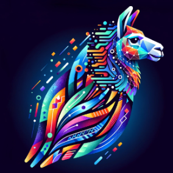

# Hoof



A spotlight like interface for interacting with local LLM / AI with [Ollama](https://ollama.ai).

Hoof is native desktop app built with [Tauri](https://tauri.studio).

_🐉 Here be dragons! This project is in early stages of development_


## Install

Clone and at the root run

```shell
pnpm install
```

## Run

### Dev

```shell
pnpm tauri dev
```

### Build for production

```shell
pnpm tauri build
```

## Authors

- Dax [@Dax911](https://github.com/Dax911)
- Sam [@sammcj](https://github.com/sammcj)
- Simon [@simoncollins](https://github.com/simoncollins)

## Contributing

Contributions and ideas are welcome, please open an issue or submit a PR.

Contributors:

- Your name here!

## License

- [LICENSE-MIT](LICENSE-MIT)
- Tauri Spotlight functionality used under MIT licence from
  [tauri-macos-spotlight-example](https://github.com/ahkohd/tauri-macos-spotlight-example)
